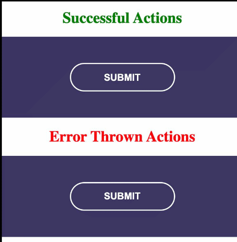

# NGXS loading Plugin

<p align="center">
  <a href="https://twitter.com/__bangash"></a>
</p>

The plugin is created for adding class to UI element by Observaving user interaction to application.

## Reasons to Use This Plugin

Most of the time we are importing so many things to show loader, disable the Ui element and like the common one is creating a boolean state in component
to check for action status, due to this plugin, we can easily handle by using [angular custom directive](https://angular.io/guide/attribute-directives), we can do the following things:

### We adding `CSS` class to the UI element to define the status of the action.

- on action dispatch we adding `active` class.
- on action success we adding `success` class.
- on action throw error we adding `error` class.

### Disable the UI element.

when action is dispatch the UI element is disabled so plugin prevents a double click on the UI element and enables once action status becomes success or error..

**_Note_**: you need to adding CSS against these classes, where user know button is press.

## Installation

Run the following code in your terminal:

```
yarn add ngx-loading-plugin
```

or if you are using npm:

```
npm install ngx-loading-plugin
```

## Usage

### Setup Before Initial Use

Import `NgxLoadingPluginModule` into your root module like:

```TS
import { NgxLoadingPluginModule } from 'ngx-loading-plugin';

@NgModule({
  imports: [
    NgxLoadingPluginModule.forRoot()
  ]
})
export class AppModule {}
```

> we can pass config object to `forRoot` to change css class name.

```TS
  NgxLoadingPluginModule.forRoot({
    cssClassName: {
      active: 'focus',
      success: 'done',
      error: 'error'
    }
  })
```

### Call a client function.

In `call function` we passing a function to the directive. the function should return observable. you can see the following example.

loading.component.ts

```TS
export class LoadingComponent {
  constructor(private store: Store) {}

  onSubmit(): Observable<any> {
    const { email, password } = this.form.value;
    return this.httpRequest(email, password).pipe(
      tap((resp) => {
        /* here your code on success */
        alert(`${JSON.stringify(resp)}`);
      }), catchError((err) => {
        alert(err);
        /* here your code on error */
        return throwError(err);
      }));
  }
}
```

here `onSubmit` returning obserable and than we pass these function to directive in the current class context.

```html
<input type="submit" value="Submit" class="button" [ngxLoading]="onSubmit.bind(this)">
  Submit
</button>
```

here 'bind' reserve the context of the current component. and send copy of function to the directive.



### License and copy right

&copy; Shahid Ahmad

License under the [MIT License](LICENSE).
